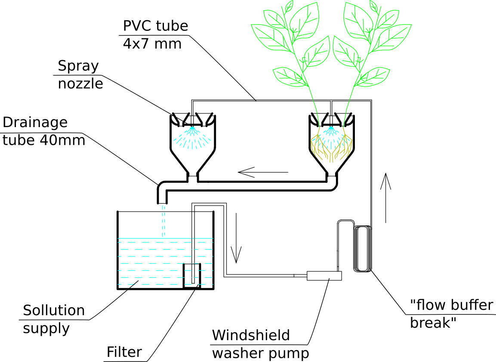
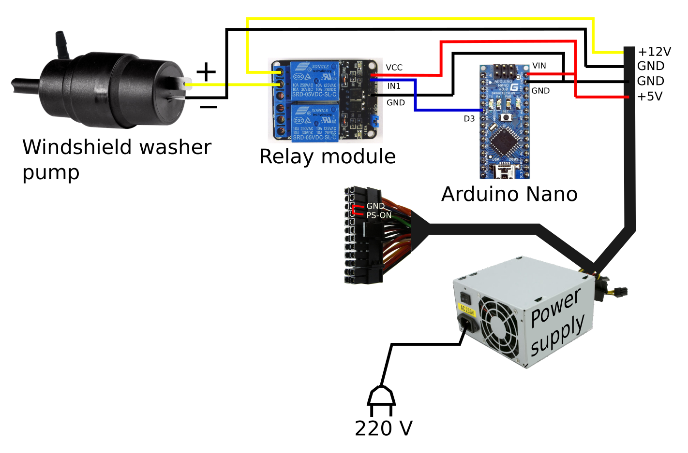
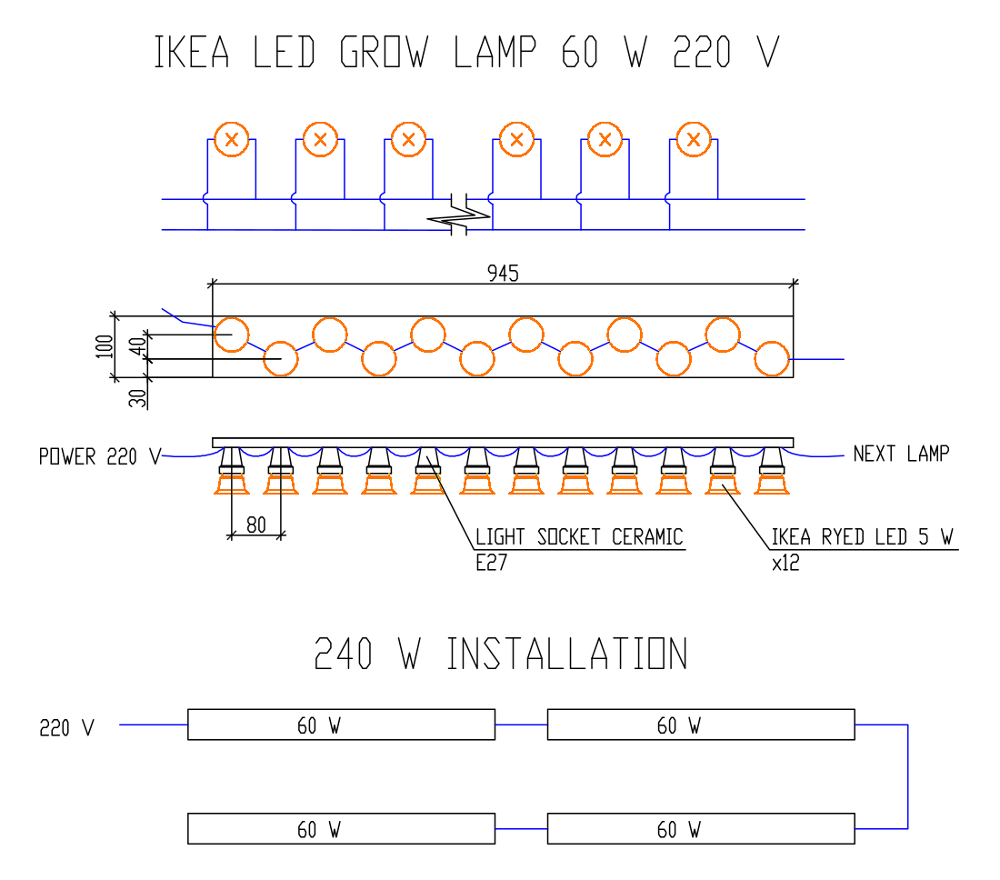

# Vertical-aeroponics-home-farm
DIY aeroponics vertical farm for growing any plants such as tomato, cucumber, strawberry etc. at home.

This project is simple aeroponics stillage with low pressure (2.5 atm and lower) and big nozzles (1 mm), which is supplied by windshield washer pump through 4/7 mm irrigation pipe. As mineral nutrient solution for plants is used differential solutions by USSR-hydroponic scientist Adam Aliev. Electronic control is carried out by Arduino Nano and relay module. Lighting - IKEA RYED LED 5 W bulbs installed in 60W grow lamp. 

See home page of project at http://vvs1864.github.io/farm/index.html (russian only, but more foto in the spoilers for understanding)

## License

The contents of this repository is released under your choice of the following two
licences:

* the "Creative Commons Attribution-ShareAlike 4.0 International License"
  (CC BY-SA 4.0) full text of this license can be
  found at http://creativecommons.org/licenses/by-sa/4.0/
* the "TAPR Open Hardware License" full text of this license is included
  in the [LICENSE.TXT](LICENSE.TXT) file and a copy can also be found at
  http://www.tapr.org/OHL

